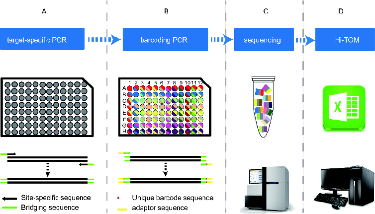
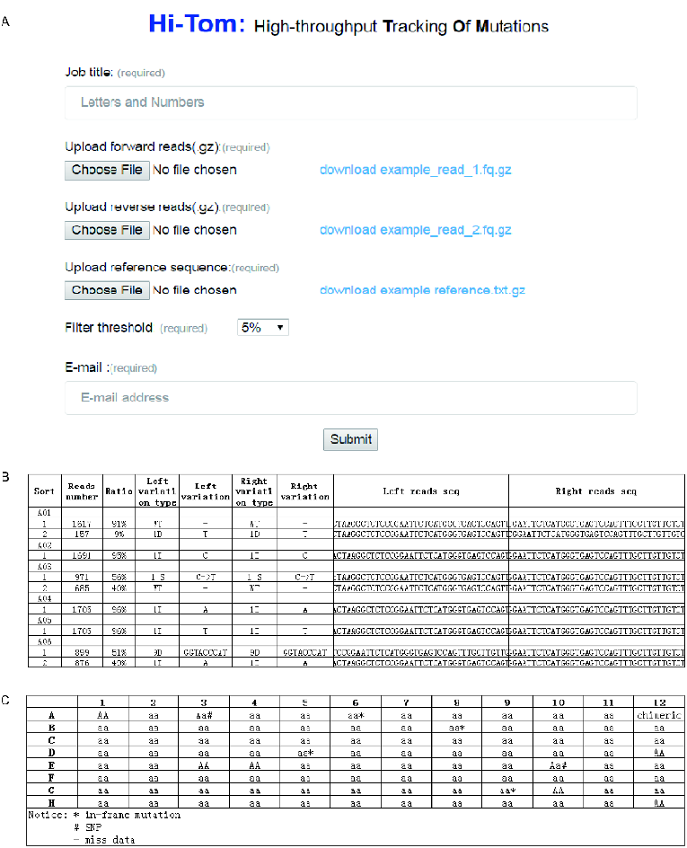
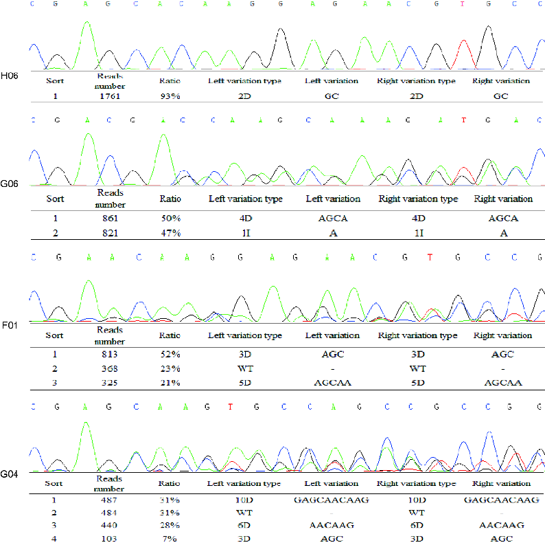
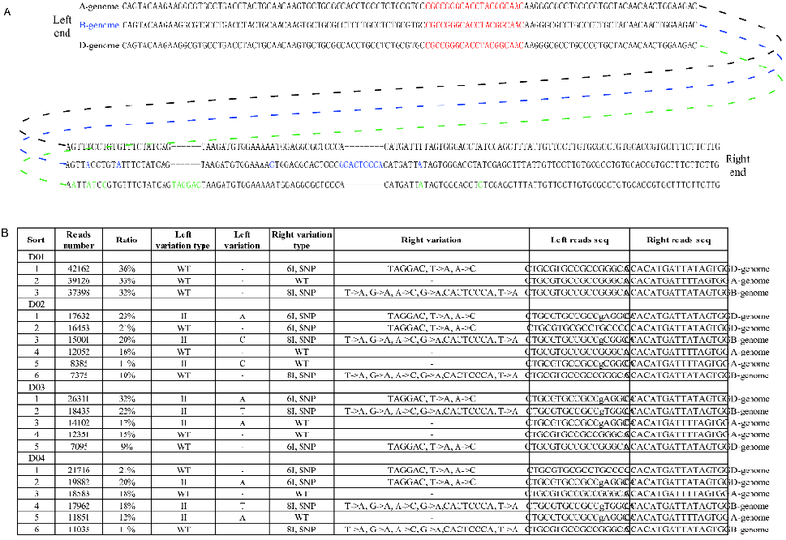

# SCIENCE CHINA

## Life Sciences

•COVER ARTICLE• January 2019 Vol.62 No.1: 1–7 https://doi.org/10.1007/s11427-018-9402-9

# Hi-TOM: a platform for high-throughput tracking of mutations induced by CRISPR/Cas systems

Qing Liu1†, Chun Wang1†, Xiaozhen Jiao1, Huawei Zhang2, Lili Song3, Yanxin Li3, Caixia Gao2 & Kejian Wang1*

1State Key Laboratory of Rice Biology, China National Rice Research Institute, Chinese Academy of Agricultural Sciences, Hangzhou 310006, China; 2State Key Laboratory of Plant Cell and Chromosome Engineering, Institute of Genetics and Developmental Biology, Chinese Academy of Sciences, Beijing 100101, China; 3Pediatric Translational Medicine Institute, Shanghai Children’s Medical Center, School of Medicine, Shanghai Jiao Tong University, Shanghai 200240, China

Received July 18, 2018; accepted August 19, 2018; published online November 13, 2018

The CRISPR/Cas system has been extensively applied to make precise genetic modifications in various organisms. Despite its importance and widespread use, large-scale mutation screening remains time-consuming, labour-intensive and costly. Here, we developed Hi-TOM (available at http://www.hi-tom.net/hi-tom/), an online tool to track the mutations with precise percentage for multiple samples and multiple target sites. We also described a corresponding next-generation sequencing (NGS) library construction strategy by fixing the bridge sequences and barcoding primers. Analysis of the samples from rice, hexaploid wheat and human cells reveals that the Hi-TOM tool has high reliability and sensitivity in tracking various mutations, especially complex chimeric mutations frequently induced by genome editing. Hi-TOM does not require special design of barcode primers, cumbersome parameter configuration or additional data analysis. Thus, the streamlined NGS library construction and comprehensive result output make Hi-TOM particularly suitable for high-throughput identification of all types of mutations induced by CRISPR/Cas systems.

###### CRISPR/Cas, genome editing, mutation identification, Hi-TOM

Citation: Liu, Q., Wang, C., Jiao, X., Zhang, H., Song, L., Li, Y., Gao, C., and Wang, K. (2019). Hi-TOM: a platform for high-throughput tracking of mutations

induced by CRISPR/Cas systems. Sci China Life Sci 62, 1–7. https://doi.org/10.1007/s11427-018-9402-9

### INTRODUCTION

CRISPR/Cas has emerged as powerful genome editing system and has been widely applied in various organisms (Wang et al., 2014; Zhang et al., 2014; Chen et al., 2017; Ran et al., 2017; Jiao and Gao, 2017; Rodríguez-Leal et al., 2017; Zhang et al., 2017). However, with the relatively high efficiency and broad applicability of genome editing in different organisms, screening mutations in a large number of samples

†Contributed equally to this work

*Corresponding author (email: wangkejian@caas.cn)

remain a time-consuming, labour-intensive and expensive process (Shen et al., 2017). To obtain sequence mutations induced by genome editing, the traditional method used is to clone PCR-amplified target regions, followed by monoclonal sequencing. Alternatively, simple strategies were also developed to identify mutations by directly analyzing the Sanger sequencing results (Brinkman et al., 2014; Xie et al., 2017). However, for a large number of samples, Sanger sequencing is expensive and the decoding process is timeconsuming. In addition, complex chimeric mutations, which are frequently generated by genome editing, remain difficult to decode.

© Science China Press and Springer-Verlag GmbH Germany, part of Springer Nature 2018 life.scichina.com link.springer.com

Due to the tremendous progress in terms of speed, throughput and cost, next-generation sequencing (NGS) has been used increasingly in biological research (Goodwin et al., 2016). With NGS, thousands to millions of sequencing reactions can be performed in parallel, which generates a valuable amount of sequence information (Metzker, 2010). Therefore, many research groups have used NGS to screen mutation patterns induced by genome editing so far. For example, AGEseq, CRISPR-GA, CRISPResso, Cas-Analyzer and CrispRVariants were developed for mutation analysis induced by genome editing. However, only one sample with multiple target sites can be analyzed each time, which are inefficient when dealing with a large number of samples (Güell et al., 2014; Xue and Tsai, 2015; Lindsay et al., 2016; Park et al., 2016; Pinello et al., 2016). CaRpool and BATCHGE can screen multiple target sites, but a series of software packages must be installed for data analysis (Boel et al., 2016; Winter et al., 2016). Here, we developed a simplified and cheap strategy that combines common experiment kits for NGS library construction and a user-friendly web tool for high-throughput analysis of multiple samples at multiple target sites. The work will facilitate the application of NGS sequencing in mutation identification, particularly for laboratories that do not have researchers with NGS or bioinformatics skills.

### RESULTS

To establish a simplified and streamlined workflow to screen mutations induced by CRISPR/Cas systems, we first mod-

ified the PCR-based library construction strategy reported by Bell (Bell et al., 2014). Library construction included two rounds of PCR, i.e., target-specific and barcoding PCR. The initial PCR primers included a target-specific sequence with common bridging sequences (5′-ggagtgagtacggtgtgc-3′ and 5′-gagttggatgctggatgg-3′) added at the 5′ end (Figure 1A). To ensure the sequencing quality of the mutated sequence, the targeted sites were designed within 10–100 nt of either the forward or reverse target-specific primers (Figure 1A). The annealing temperature of the first PCR was determined by the Tm value of the target-specific sequences. The first-round PCR products were further barcoded during the secondround PCR. Common primers for the second-round PCR include platform-specific adaptor sequence, fixed barcode sequence and bridging sequence (Figure 1B, Table S1 in Supporting Information). To improve the recognition ability and reduce the sample confusion, the barcodes with four nucleic acid bases that contain at least two nucleotides difference with one another were designed. In addition, to ensure high sequencing quality of barcode, four spacer bases were also added between the sequencing primers and barcodes. To establish a standard platform for data analysis, 12 forward and eight reverse primers were fixed as common primers for the second PCR step. Thus, it was possible to create a uniquely barcoded amplicon for up to 96 samples

- (Figure 1B, Table S1 and S2 in Supporting Information). The second PCR contains two pairs of primers, which were mixed in 1:500 proportions in each reaction mix (Table S1 in Supporting Information). For convenience, the primers and PCR mix can be pre-assembled as standard 96-well PCR kits
- (Figure 1B, Table S2 in Supporting Information), so there is

- Figure 1 Schematic illustration of the workflow of Hi-TOM. A, The samples are amplified using site-specific primers (target-specific PCR). B, The products of the first-round PCR are used as templates for the second-round PCR (barcoding PCR) in the 96-hole plate kit. By barcoding PCR, the products of each sample are barcoded. C, All products of the second-round PCR are pooled in equimolar amounts in a single tube and sent for NGS. D, Hi-TOM analyses the data sample-by-sample and exports the results in Excel format.

no need to prepare PCR mix each time. After the secondround PCR amplification, the products of all samples were mixed with equal amount. If multiple targets (number: N) are required for identification, all products (96×N) can be mixed as a single sample and sent for NGS sequencing. In most cases, 1 Gb sequencing data, the size of which is about 100 Mb after gzip compression, is enough for mutation analysis.

Then we developed a corresponding Hi-TOM platform for high-throughput mutation sequence decoding (http://www. hi-tom.net/hi-tom/). The algorithm behind Hi-TOM was implemented in a Perl script (v5.16.3). The format of the clean data directly produced by NGS instrument or provided by an NGS company is typically gzip-compressed. Hi-TOM uses clean NGS data directly as an input to generate a detailed genome editing report. The first step is entering a working directory (note that filenames cannot include spaces) to avoid conflicts with other tasks. The second step is clicking the “Choose File” buttons to upload the forward reads (named_1.fq.gz) and reverse reads (named_2.fq.gz) (Figure 1D and 2A). The third step is to upload the reference sequence length in approximately 1000 nt (typically 500 nt before and after the target sequence)(Figure 2A). If multiple targets are analyzed simultaneously, the reference sequences of different targets are sorted in a text file in FASTA format and submitted (Figure 2A). The fourth step is to select the filter threshold which can filter out some low percentage mutation types. The fifth step is to enter the mailbox address which the result will be sent to after the analysis is completed. Then, the submit button is clicked and data are uploaded to the server automatically and directly input into the analysis process. And analysis is performed sample-bysample in an automated manner. If individual raw data for each sample is needed, clicking the “Spliter” button to enter the data split main page. Hi-TOM analyses the uploaded data and performs quantitative analysis of mutations in three steps. (i) Hi-TOM first finds the reference sequence, converts it to FASTA format, then indexes the reference sequence using BWA software and prepares for the following mapping (Li and Durbin, 2009). (ii) The corresponding uploaded data file is then decompressed and the barcodes of each sequence are extracted, the value of each base must be greater than 30 (>Q30). The error sequences resulting from mismatch of primers are eliminated. The sequences are split using the designed barcodes individually. (iii) All reads are mapped to the indexed reference genome after trimming and removing low quality bases using the BWA-MEM (version 0.7.10) algorithm, which shows good performance while mapping reads sequences (Li and Durbin, 2009). A Sequence Alignment Map file is then generated. Using this file, the Hi-TOM algorithm screens paired-end reads for sequence alterations, extracts mutation information for each read, and counts the reads number of all type of mutations individually. If the read is trimmed from the target site by BWA and no small InDels

are detected, it will be identified as large InDels. The aligned results are categorized by mutation type and sorted in descending order of the reads number for each mutation and sample individually. Mutations with the most reads numbers are extracted for each sample, which ensures the decoding of introduced mutations. Hi-TOM integrates the results of 96 samples into a Microsoft Excel document. In each document, the mutation types and positions of each sample are listed in detail, including reads number, ratio, mutation type, mutation bases and DNA sequence (Figure 2B). As determining the genotype is crucial in many studies, the genotype of each sample is also analyzed and summarized in an additional Excel document (Figure 2C). Since in-frame mutations and SNP mutations do not necessarily lead to phenotype changes, the samples containing those mutations are highlighted in the table.

In order to demonstrate the applicability and efficiency of the strategy, two sets of genome-edited materials with four target sites were tested, including rice and human cells. Using the aforementioned strategy, we performed two rounds of PCRs using the site-specific primers and pre-assembled standard 96-well PCR kits. After amplification, the products were pooled, purified and sent for NGS. A total of 1 G clean reads were obtained after NGS sequencing. After reads uploading and analyzing, eight excel documents respectively corresponding to those four target sites were automatically generated by Hi-TOM (Figure 2B and C, Tables S3 and S4 in Supporting Information). The result shows that sufficient coverage was achieved across all samples at all four target sites.

The CRISPR/Cas systems usually generate biallelic, heterozygous and chimeric mutations. The proportions of some mutation types are low and often overlooked. The sensitivity of Hi-TOM was analyzed by comparing with the results of Sanger sequencing. The Sanger sequencing chromatograms showed that the peak values of some mutations are low and complex, which cannot be identified by chromatogram recognition software. In contrast, all these chimeric mutations that contain three, four, even more mutation types were accurately identified by Hi-TOM (Figure 3, Table S3 and S4 in Supporting Information). In addition to complex chimeric mutations, in-frame mutations and SNP mutations were identified correctly, implying the sensitivity and accuracy of Hi-TOM (Figure 3, Table S3 and S4 in Supporting Information).

For polyploid organisms, it still remains a tedious process to analyze mutations on different sets of chromosomes. To test whether Hi-TOM can be used for identification of mutations on different chromosomes in polyploid organism, 64 hexaploid wheat (Triticum aestivum, AABBDD) samples were chosen for analysis. To distinguish the A, B and D genomes, InDel and SNP variations on the genome were amplified in the fragment. During Hi-TOM analysis, the

- Figure 2 The home page of Hi-TOM and result of example. A, The home page of Hi-TOM. Job title stands for working directory; upload the NGS reads stands for uploading the forward reads (named_1.fq.gz) and reverse reads (named_2.fq.gz). B, An example of Hi-TOM sequence results. The results are summarised in the table. The results are populated in nine columns as follows: sample code and mutant name; read number; ratio; left variation type; left variation; right variation type; right variation; left read sequence; right read sequence. In the variation type volume, I, D and S indicate the insertion, deletion and SNP, respectively. For example, 3D represents the deletion of three bases and 1I represents insertion of one base. In the reads sequence column, the location of the mutation is indicated in lowercase. C, An example of Hi-TOM genotype results. AA stands for wild-type genotype; Aa stands for heterozygous genotype; aa stands for homozygous mutant genotype; * stands for in-frame mutation; # stands for SNP; - stands for missing data.

- sequence of A-genome was set as the reference genome. Compared with the amplified sequence of A-genome, the
- sequence of B-genome has 8 bp insertions and 5 SNPs, while the sequence of D-genome has 6 bp insertions and 2 SNPs. The results showed that three sets of genomes can be distinguished from each other by analyzing those variations. Meanwhile, the mutations on each genome were successfully tracked (Figure 4), suggesting the robustness of Hi-TOM in identification of mutations in polyploid organisms.

### DISCUSSION

Here we developed a systematic strategy which fixed the second-round PCR primers for the construction of NGS library and established the user-friendly Hi-TOM platform for large-scale mutation identification, which enables the accurate quantification and visualization of mutation outcomes, and comprehensive evaluation of numerous mutation sequences. The possibility of bar coding hundreds of samples

- Figure 3 The Sanger sequencing chromatograms and different mutation types tracked by Hi-TOM. H06 represents homozygous mutation; G06 indicates heterozygous mutation; F01 shows chimeric mutation with three variation types; G04 displays chimeric mutation with four variation types.

with multiple target sites in one sequencing sample makes it competitive economic perspective. As 1 Gb sequencing data is sufficient to analyze hundreds or even thousands of amplicons, the cost can be extremely cheap when analyzing large number of samples or sites. At present, compared with normal Sanger sequencing, it takes much longer time to accomplish the next-generation sequencing (about 5–15 days). However, with the rapid development of NGS technique, the sequencing might be accelerated in a very short term. In terms of cost, the price of 1Gb NGS data is about 15 USD, and Sanger sequencing costs nearly 2 USD per sample. So if more than 20 samples are analyzed and the time is not very urgent, it is beneficial to use NGS and Hi-TOM. If such kind of sample number is not so large, using direct Sanger sequencing of PCR products is prior in aspects of time and cost. Additionally, when large InDel mutations are generated by CRISPR-Cas system, direct Sanger sequencing is also preferred to determine the detailed sequence of large InDels.

### MATERIALS AND METHODS

##### NGS library construction

The primary PCR was performed to amplify the targeted genomic DNA with a pair of site-specific primers with common bridging sequences (5′-ggagtgagtacggtgtgc-3′ and 5′-gagttggatgctggatgg-3′) added at the 5′ end. The primary amplification was performed in a 20 µL reaction volume containing 50 ng of genomic DNA, 0.3 µmol L–1 of specific forward and reverse primer, and 10 µL 2×Taq Master Mix (Novoprotein Scientific, China). The secondary amplification was conducted in 20 µL preassembled kits, each containing 10 µL 2×Taq Master Mix, 200 nmol L–1 2P-F and 2PR primer, 2 nmol L–1 F-(N) and R-(N) primer (Supplementary Table 1), and 1 µL primary PCR product. PCR conditions were 3 min at 94°C (1×), 30 s at 94°C, 30 s at annealing temperature and 30 s at 72°C (33×), followed by 72 °C for 2 min.

- Figure 4 The amplified fragments and Hi-TOM result of hexaploid wheat (Triticum aestivum, AABBDD). A, The amplified fragments of A, B and D genomes. The red letters indicate the target sites; the green letters represent sequence variations to distinguish between A genome and B genome; the blue letters show sequence variations to distinguish between A genome and D genome. B, The Hi-TOM result of hexaploid wheat. The mutation variations were displayed in the left variation type while the genomes were shown in the right variation type. WT indicates the A-genome, 8I exhibits the B-genome, and 6I represents the D-genome.

##### Next generation sequencing

The libraries were sequenced using the Illumina HiSeq platform (Illumina, USA) by the Novogene Bioinformatics Institute, Beijing, China. The concentration of the libraries was initially measured using Qubit®2.0 (Life Technologies, USA). The libraries were diluted to 1 ng µL–1 and an Agilent Bioanalyzer 2100 (Agilent, USA) was used to test the insert size of the libraries. To ensure quality, the SYBR green qRTPCR protocol was used to accurately dose the effective concentration of the libraries.

##### Filtering reads and mapping reads

Paired end (PE) reads with 150 bp were determined and the clean reads were collected from sequenced reads, which were pre-processed to remove adaptors and low quality paired reads. The following criteria were used to remove the low quality reads: (i) containing more than 10% ‘N’s; (ii) more than 50% bases having low quality value (Phred score ≤5); (iii) duplicated reads were removed and coverage va-

lues were calculated using SAMTOOLS (Li and Durbin, 2009).

Compliance and ethics The authors filed a patent application (Chinese patent application number 201710504178.3) based on the results reported in this paper.

Acknowledgements We are extremely grateful to Ruiqiang Li from Novogene Bioinformatics Institute for critical reading of the manuscript. We thank Zheng Ruan and his team from Novogene Co., Ltd for NGS technical service. We also thank Yangwen Qian from Hangzhou Biogle Co., Ltd for rice transformation. This work was supported by the National Key Research and Development Program of China (2017YFD0102002), the Agricultural Science and Technology Innovation Program of Chinese Academy of Agricultural Sciences, and the National Natural Science Foundation of China (31401363).

##### References

Bell, C.C., Magor, G.W., Gillinder, K.R., and Perkins, A.C. (2014). A high-throughput screening strategy for detecting CRISPR-Cas9 induced mutations using next-generation sequencing. BMC Genomics 15, 1002.

Boel, A., Steyaert, W., De Rocker, N., Menten, B., Callewaert, B., De Paepe, A., Coucke, P., and Willaert, A. (2016). BATCH-GE: Batch

analysis of Next-Generation Sequencing data for genome editing assessment. Sci Rep 6, 30330.

Brinkman, E.K., Chen, T., Amendola, M., and van Steensel, B. (2014). Easy quantitative assessment of genome editing by sequence trace decomposition. Nucleic Acids Res 42, e168.

Chen, Y., Wang, Z., Ni, H., Xu, Y., Chen, Q., and Jiang, L. (2017). CRISPR/Cas9-mediated base-editing system efficiently generates gainof-function mutations in Arabidopsis. Sci China Life Sci 60, 520–523.

Goodwin, S., McPherson, J.D., and McCombie, W.R. (2016). Coming of age: ten years of next-generation sequencing technologies. Nat Rev Genet 17, 333–351.

Güell, M., Yang, L., and Church, G.M. (2014). Genome editing assessment using CRISPR Genome Analyzer (CRISPR-GA). Bioinformatics 30, 2968–2970.

Li, H., and Durbin, R. (2009). Fast and accurate short read alignment with Burrows-Wheeler transform. Bioinformatics 25, 1754–1760.

Lindsay, H., Burger, A., Biyong, B., Felker, A., Hess, C., Zaugg, J., Chiavacci, E., Anders, C., Jinek, M., Mosimann, C., et al. (2016). CrispRVariants charts the mutation spectrum of genome engineering experiments. Nat Biotechnol 34, 701–702.

Metzker, M.L. (2010). Sequencing technologies—the next generation. Nat Rev Genet 11, 31–46.

Park, J., Lim, K., Kim, J.S., and Bae, S. (2016). Cas-analyzer: an online tool for assessing genome editing results using NGS data. Bioinformatics 33, 286–288.

Pinello, L., Canver, M.C., Hoban, M.D., Orkin, S.H., Kohn, D.B., Bauer, D. E., and Yuan, G.C. (2016). Analyzing CRISPR genome-editing experiments with CRISPResso. Nat Biotechnol 34, 695–697.

Ran, Y., Liang, Z., and Gao, C. (2017). Current and future editing reagent delivery systems for plant genome editing. Sci China Life Sci 60, 490–

505. Jiao, R., and Gao, C. (2017). Anything impossible with CRISPR/Cas9? Sci China Life Sci 60, 445–446.

Rodríguez-Leal, D., Lemmon, Z.H., Man, J., Bartlett, M.E., and Lippman, Z.B. (2017). Engineering quantitative trait variation for crop improvement by genome editing. Cell 171, 470-480.

Shen, L., Hua, Y., Fu, Y., Li, J., Liu, Q., Jiao, X., Xin, G., Wang, J., Wang, X., Yan, C., et al. (2017). Rapid generation of genetic diversity by multiplex CRISPR/Cas9 genome editing in rice. Sci China Life Sci 60, 506–515.

Wang, Y., Cheng, X., Shan, Q., Zhang, Y., Liu, J., Gao, C., and Qiu, J.L. (2014). Simultaneous editing of three homoeoalleles in hexaploid bread wheat confers heritable resistance to powdery mildew. Nat Biotechnol 32, 947–951.

Winter, J., Breinig, M., Heigwer, F., Brügemann, D., Leible, S., Pelz, O., Zhan, T., and Boutros, M. (2016). caRpools: an R package for exploratory data analysis and documentation of pooled CRISPR/Cas9 screens. Bioinformatics 32, 632–634.

Xie, X., Ma, X., Zhu, Q., Zeng, D., Li, G., and Liu, Y.G. (2017). CRISPRGE: a convenient software toolkit for cRISPR-based genome editing. Mol Plant 10, 1246-1249.

Xue, L.J., and Tsai, C.J. (2015). AGEseq: analysis of genome editing by sequencing. Mol Plant 8, 1428–1430.

Zhang, H., Zhang, J., Wei, P., Zhang, B., Gou, F., Feng, Z., Mao, Y., Yang, L., Zhang, H., Xu, N., et al. (2014). The CRISPR/Cas9 system produces specific and homozygous targeted gene editing in rice in one generation. Plant Biotechnol J 12, 797–807.

Zhang, X., Wang, L., Liu, M., and Li, D. (2017). CRISPR/Cas9 system: a powerful technology for in vivo and ex vivo gene therapy. Sci China Life Sci 60, 468–475.

#### SUPPORTING INFORMATION

- Table S1 The primers developed for the PCR-based library construction kits
- Table S2 Distribution of primer combinations in a 96-hole plate
- Table S3 An example of sequence results in human cells
- Table S4 An example of genotype results in human cells

The supporting information is available online at http://life.scichina.com and https://link.springer.com. The supporting materials are published as submitted, without typesetting or editing. The responsibility for scientific accuracy and content remains entirely with the authors.

